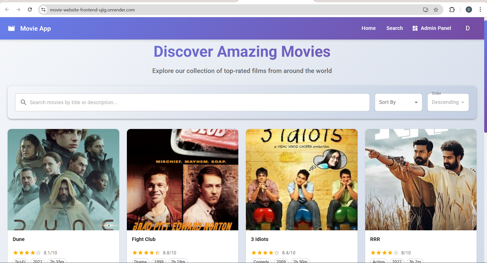
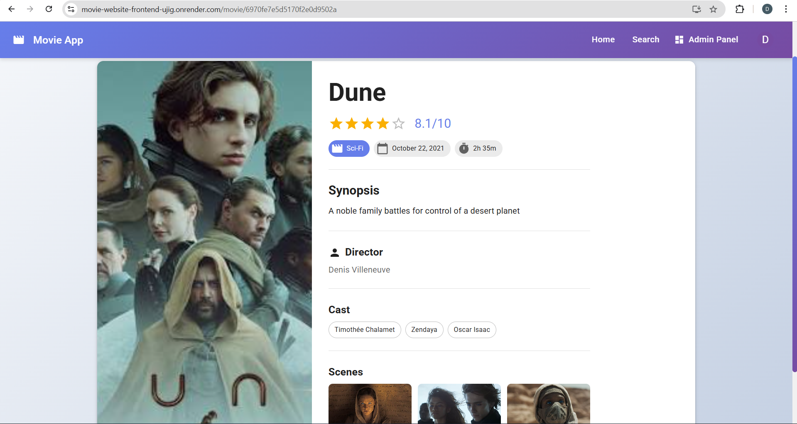
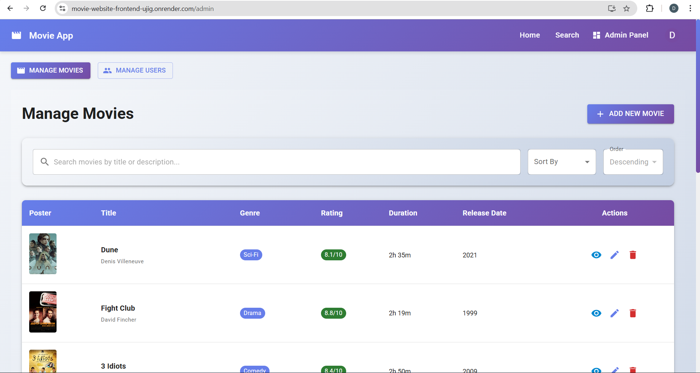
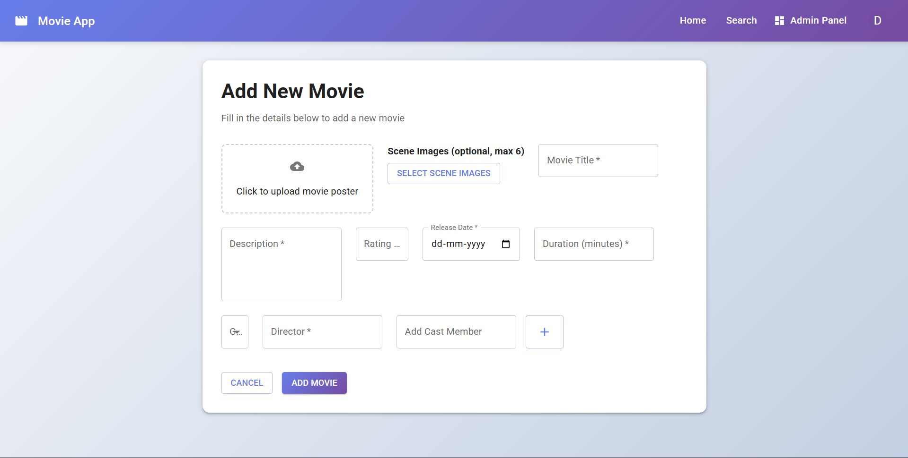
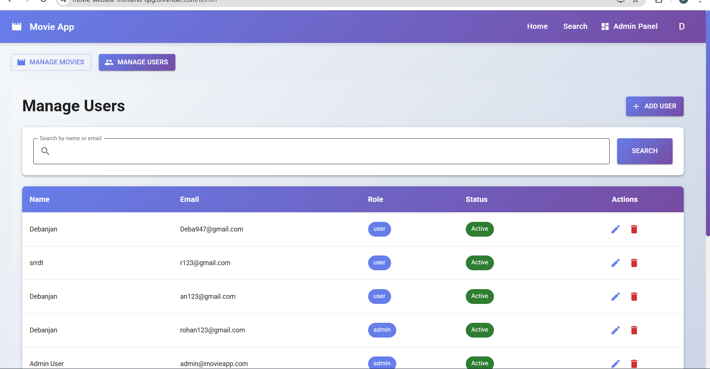

# 🎬 Movie Management Application (MERN Stack)

A brief description of what this project does and who it's for


## Running Tests

To run tests, run the following command

```bash
  npm run test
```


## 🚀 Live Application


Frontend: https://movie-website-frontend-ujig.onrender.com

Backend: https://your-backend-url.onrender.com
## Tech Stack

**Frontend:** React.js, Material UI, React Router DOM, Axios, Context API

**Backend:** Node.js, Express.js, MongoDB Atlas, Mongoose, JWT Authentication, Multer, Cloudinary


## Features

**User**

- Browse movie listings
- Search movies by title
- Sort movies by rating & release date
- View detailed movie information
- Scene image gallery


**Admin**

- Scene image gallery
- Add new movies
- Edit existing movies
- Delete movies
- Upload poster & scene images
- User management
## Screenshots

**🏠 Home Page**



**🎬 Movie Details Page**



**🔐 Admin Dashboard (Admin)**



**➕ Add Movie (Admin)**



**✏️ Edit Movie (Admin)**


**👥 Manage Users (Admin)**




## 📁 Project Structure


movie-app/
│
├── movie-backend/
│   ├── controllers/
│   ├── routes/
│   ├── models/
│   ├── middleware/
│   ├── config/
│   ├── utils/
│   ├── uploads/
│   ├── server.js
│   └── package.json
│
├── frontend/
│   ├── src/
│   │   ├── components/
│   │   ├── pages/
│   │   ├── context/
│   │   ├── routes/
│   │   └── App.jsx
│   └── package.json
│
├── screenshots/
│
└── README.md

## ⚙️ Environment Variables

**Backend**

PORT=4000
JWT_SECRET=your_jwt_secret
MONGODB_URI=your_mongodb_atlas_uri

CLOUDINARY_CLOUD_NAME=xxxx
CLOUDINARY_API_KEY=xxxx
CLOUDINARY_API_SECRET=xxxx

**Frontend**

REACT_APP_API_URL=Backend_Deployment_Link


## ▶️ Run Project Locally

**1️⃣ Clone Repository**

git clone https://github.com/your-username/movie-app.git
cd movie-app


**2️⃣ Backend Setup**

cd movie-backend
npm install
npm run dev


**3️⃣ Frontend Setup**

cd frontend
npm install
npm start

## API Reference

#### Authentication

```http
  POST /api/user
```

| Method    | Endpoint | Description                |
| :-------- | :------- | :------------------------- |
| `POST`    | `/api/user/register` | Register new user |
|`POST`     | `/api/user/login`    | Login user/admin

#### Movies (Public)

```http
  GET /api/movies
```

| Method    | Endpoint | Description                       |
| :-------- | :------- | :-------------------------------- |
| `GET`     | `/api/movies/list` | Get all movies |
| `GET`     | `/api/movies/:id`  | Get movie by ID |
| `GET`     | `/api/movies/search`| Search movies |
| `GET`     | `/api/movies/sorted`| Sort movies  |


#### Movies (Admin Only)


| Method    | Endpoint | Description                       |
| :-------- | :------- | :-------------------------------- |
| `POST`     | `/api/movies/add` | Add movie |
| `PUT`      | `/api/movies/:id`  | Update movie |
| `DELETE`   | `/api/movies/:id`| Delete movie |


#### User Management (Admin Only)


| Method    | Endpoint | Description                       |
| :-------- | :------- | :-------------------------------- |
| `GET`     | `/api/user/list` | Get all movies |
| `GET`     | `/api/user/:id`  | Get user by ID |
| `PUT`     | `/api/user/:id`  | Update User    |
| `DELETE`  | `/api/user/:id`  | Delete user  |

#### add(num1, num2)

Takes two numbers and returns the sum.


## Deployment

To deploy this project run


**Frontend**

Build command:
```bash
  npm run build
```
Publish directory:
```bash
  build
```

**Backend**

Start command:
```bash
  node server.js
```

## 🧪 Testing

API tested using Postman

JWT authentication tested

Role-based access verified
## Authors

- [Debanjan Mondal](https://www.linkedin.com/in/debanjan-mondal-a66953280/)

